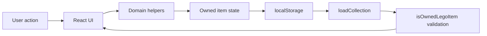

# Brick Ledger

Brick Ledger is a local-first LEGO collection tracker for web, designed so the same domain model can later power an iOS app. It lets you search a seeded LEGO catalog, add sets or minifigs to either your collection or wishlist, scan supported barcodes, and maintain ownership details such as condition, box status, build progress, display location, estimated value, missing parts, and notes.

## Current Status

This is the first web version. Data is stored in the browser with `localStorage`, and catalog lookup currently uses a small seeded catalog in `src/domain/catalog.ts`. There is no account system or cloud sync yet.

## Features

- Search by set number, minifig number, theme, keyword, type, or seeded barcode.
- Add catalog entries to your collection or wishlist.
- Move an item between collection and wishlist from the detail form.
- Track item quality when bought:
  - New
  - New, open box
  - Used with box and instructions
  - Used with no box
  - Used with no instructions
  - Used with missing parts
- Track whether the box was saved.
- Track building status: not started, in progress, or complete.
- Track display location, quantity, missing parts, and freeform notes.
- See summary counters for owned items, wishlist items, estimated owned value, and completed builds.
- Scan barcodes in browsers that support the Barcode Detection API, with manual barcode entry as a fallback.
- Filter malformed saved browser data before loading it into the app.

## Quick Start

Prerequisites:

- Node.js 18 or newer
- npm

Install dependencies:

```bash
npm install
```

Start the development server:

```bash
npm run dev
```

Open the local URL printed by Vite. The default is usually:

```text
http://localhost:5173/
```

Build for production:

```bash
npm run build
```

Preview the production build:

```bash
npm run preview
```

## Normal Usage Example

1. Start the app with `npm run dev`.
2. Search for `castle`, `10305`, `Star Wars`, or another seeded catalog keyword.
3. Select a result to open its detail page.
4. Click **Add to collection** or **Add to wishlist**.
5. Update the detail form:
   - Choose the purchase quality.
   - Mark whether the box was saved.
   - Set build status to `Not started`, `In progress`, or `Complete`.
   - Add a display location such as `Office shelf`.
   - Add notes or missing part details if needed.
6. Use the Collection and Wishlist tabs to review tracked items.
7. Refresh the page; saved items should still be present because they are stored in browser local storage.

## Barcode Usage

Click the barcode button beside search.

If your browser supports camera barcode detection:

1. Allow camera permission.
2. Point the camera at the barcode.
3. If the barcode matches a seeded catalog item, it is added to the collection.

If camera scanning is unsupported or permission fails:

1. Enter the barcode manually in the scanner modal.
2. Click **Search**.
3. Known seeded barcodes resolve to catalog items. Unknown barcodes are copied into search so future catalog support can handle them.

## Data Flow



## Project Layout

```text
src/
  api/        React entrypoint and web UI
  domain/     Pure catalog, collection, and option-label logic
  services/   Browser/device boundaries such as localStorage and barcode scanning
  types/      Shared TypeScript contracts
docs/
  architecture.md
  setup.md
  user-guide.md
  troubleshooting.md
```

## Documentation

- [Setup Guide](docs/setup.md)
- [User Guide](docs/user-guide.md)
- [Architecture](docs/architecture.md)
- [Troubleshooting](docs/troubleshooting.md)

## Verification

Run these before handing off changes:

```bash
npm run build
harness validate
```

## Known Limitations

- Catalog data is seeded locally and intentionally small.
- Estimated values are static sample values.
- Barcode scanning depends on browser support for `BarcodeDetector`.
- Data is stored per browser profile and device; clearing site data removes saved collection records.
- There is no iOS app yet, but the shared TypeScript model is structured so an iOS client can map to the same concepts later.
