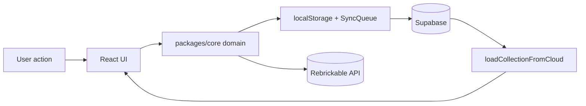

# Brick Ledger

Brick Ledger is a local-first LEGO collection tracker for web, designed so the same domain model can later power an iOS app. It lets you search the Rebrickable catalog (27k+ sets), add sets or minifigs to your collection or wishlist, scan barcodes, view per-bag parts lists with CSV/BSX export, download building instructions, and track missing parts with structured export.

## Current Status

M1–M6 complete. Cloud sync via Supabase is live — collection data persists across devices. The iOS client (M7) is next on the roadmap.

## Features

- Search by set number, minifig number, theme, or keyword — powered by the Rebrickable API with Supabase caching.
- Barcode scanning: chains seed catalog → Supabase cache → Rebrickable live lookup.
- Add catalog entries to your collection or wishlist.
- Track item quality, box status, build progress, display location, quantity, and notes.
- Per-set parts list grouped by bag, with full-set and per-bag CSV/BSX export.
- Building instructions: download booklets directly from LEGO.com CDN.
- Missing parts list: mark individual parts as missing, export as CSV or BrickLink BSX.
- Multi-device cloud sync via Supabase with offline queue and last-write-wins reconciliation.
- Export entire collection as JSON or CSV.
- Summary counters: owned items, wishlist, estimated value, completed builds.

## Quick Start

Prerequisites: Node.js 20+, npm, a [Supabase](https://supabase.com) project, a [Rebrickable API key](https://rebrickable.com/api/).

```bash
git clone https://github.com/bri-stevenski/lego-tracker.git
cd lego-tracker
npm install
cp .env.example .env   # fill in VITE_SUPABASE_URL, VITE_SUPABASE_PUBLISHABLE_KEY, VITE_REBRICKABLE_API_KEY
npm run web:dev
```

Open `http://localhost:5173/`.

```bash
npm run web:build    # production build
npm test             # all tests (150 core + 27 web)
npm run typecheck    # TypeScript across all packages
```

## Normal Usage Example

1. Start the app with `npm run web:dev`.
2. Search for `castle`, `10305`, or any set name/number.
3. Select a result to open its detail panel.
4. Click **Add to collection** or **Add to wishlist**.
5. Update the detail form: quality, box, build status, display location, notes.
6. Open the **Parts** section to see the full parts list grouped by bag — export as CSV or BSX.
7. Mark individual parts missing with the **!** button; export the missing list from the **Missing Parts** section.
8. Open **Building Instructions** to download booklets from LEGO.com.
9. Data syncs to Supabase automatically every 5 minutes and on reconnect.

## Barcode Usage

Click the barcode button beside search.

1. Allow camera permission (or enter the barcode manually).
2. Point the camera at the barcode.
3. The app chains: seed catalog → Supabase cache → Rebrickable. If found, the item is added to your collection. If not found, the barcode is copied into search.

## Data Flow



## Project Layout

```text
apps/
  web/          Vite + React web app
  mobile/       iOS client (M7 — not yet started)
packages/
  core/         Shared domain logic, types, services
supabase/
  functions/    Edge Functions (instructions scraper)
  migrations/   Database schema
scripts/
  seed-catalog  Bulk Rebrickable CSV import
docs/
  architecture.md
  setup.md
  user-guide.md
  troubleshooting.md
  roadmap.md
```

## Documentation

- [Setup Guide](docs/setup.md)
- [User Guide](docs/user-guide.md)
- [Architecture](docs/architecture.md)
- [Troubleshooting](docs/troubleshooting.md)
- [Roadmap](docs/roadmap.md)

## Verification

```bash
npm test             # all tests
npm run typecheck    # type safety
npm run web:build    # production bundle
```

## Known Limitations

- Estimated values are static (no live pricing source).
- Barcode scanning requires browser `BarcodeDetector` support (Chrome/Edge; Safari via polyfill).
- In-app PDF viewer for building instructions is deferred — LEGO PDFs are 100MB+, no CORS access.
- Step-by-step part tracking is deferred pending the instruction viewer.
- iOS client (M7) not yet started.
