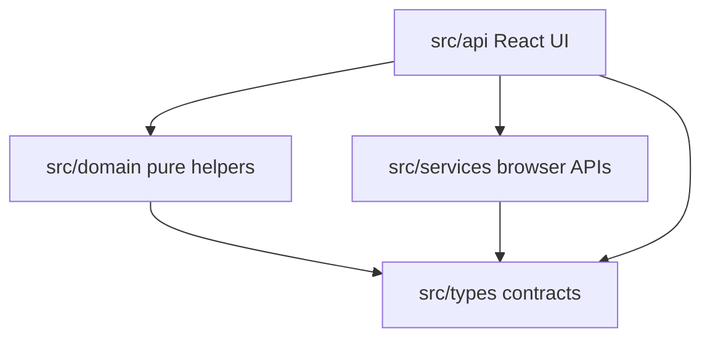
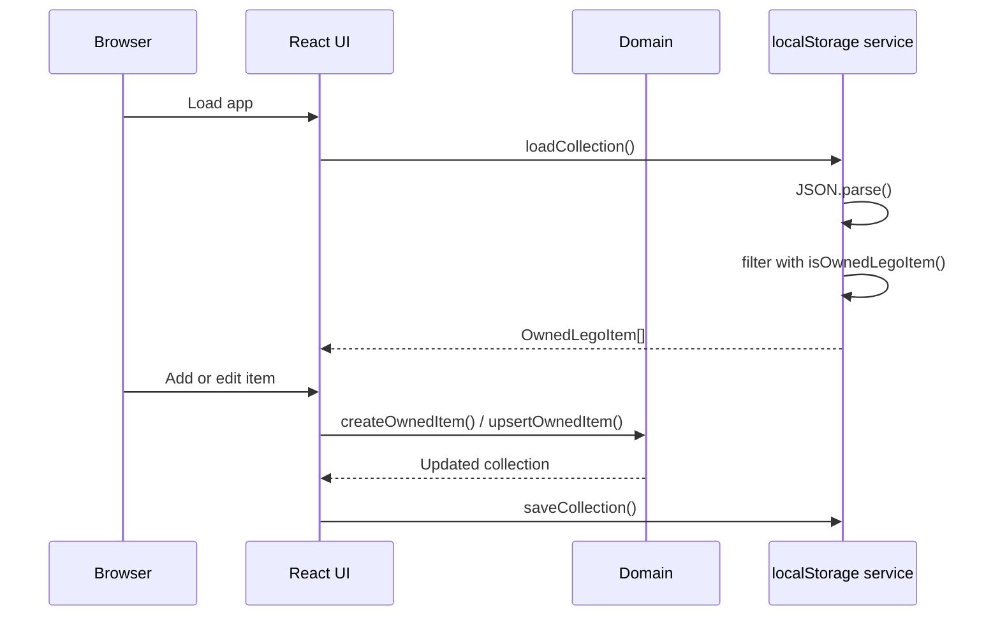
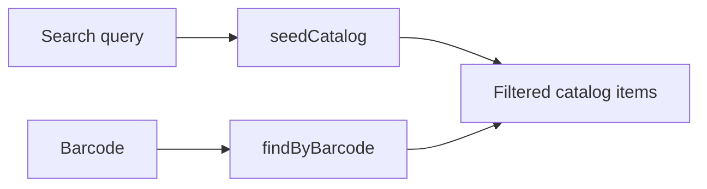

# Architecture

Brick Ledger starts as a local-first web app with a shared domain model that can be reused by an iOS client later.

## Goals

- Keep the first version fast and usable without accounts or a backend.
- Keep collection concepts in shared, explicit types.
- Isolate browser-only functionality behind service modules.
- Make future catalog and sync backends replaceable without rewriting the UI.

## Layers

| Layer | Path | Responsibility |
| --- | --- | --- |
| Types | `src/types` | Shared TypeScript contracts for catalog and owned LEGO items. |
| Domain | `src/domain` | Pure search, collection, summary, upsert, and label logic. |
| Services | `src/services` | Browser/device boundaries such as localStorage and barcode scanning. |
| API/UI | `src/api` | React entrypoint, application state, and user interface. |

## Dependency Direction



The domain layer does not import React, browser APIs, or service modules. This keeps core behavior portable for future iOS, backend, or test-suite work.

## Runtime Data Flow



## Data Model

`LegoCatalogItem` describes catalog data:

- ID
- Set or minifig type
- Number
- Name
- Theme
- Year
- Piece count
- Retirement status
- Estimated value
- Image URL
- Optional barcode

`OwnedLegoItem` extends catalog data with ownership tracking:

- Collection or wishlist status
- Acquisition quality
- Saved-box flag
- Build status
- Display location
- Notes
- Missing parts
- Quantity
- Added and updated timestamps

## Persistence

The current app persists collection and wishlist records in browser localStorage under:

```text
brick-ledger.collection.v1
```

`loadCollection()` intentionally validates loaded entries with `isOwnedLegoItem()` before returning them. This prevents malformed localStorage data from leaking into the UI.

## Catalog Source

Catalog lookup is seeded locally in `src/domain/catalog.ts`.



A future catalog service can replace or supplement this file with:

- Rebrickable
- Brickset
- BrickLink-derived data
- A Supabase-backed catalog mirror

The desired boundary is to keep search result objects compatible with `LegoCatalogItem` so the React screens and ownership logic remain mostly unchanged.

## Future iOS Path

The current TypeScript model maps cleanly to an iOS data model:

| Web Type | iOS Equivalent |
| --- | --- |
| `LegoCatalogItem` | Catalog set/minifig DTO or Swift model |
| `OwnedLegoItem` | Persisted collection record |
| `CollectionStatus` | Swift enum for collection or wishlist |
| `AcquisitionQuality` | Swift enum for item condition |
| `BuildStatus` | Swift enum for build progress |

When a backend is added, both web and iOS should talk to the same catalog and collection API rather than maintaining separate persistence rules.

## Change Guidelines

- Put reusable business logic in `src/domain`.
- Put browser APIs, camera APIs, localStorage, or future network clients in `src/services`.
- Keep `src/api/main.tsx` focused on UI state and composition.
- Extend `src/types/lego.ts` before adding ad hoc fields to UI state.
- Update `docs/user-guide.md` whenever visible behavior changes.
- Update this file when layer responsibilities or data flow change.
