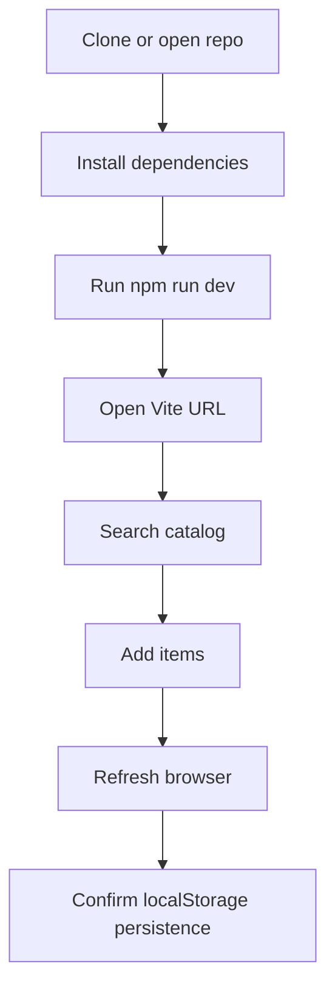

# Setup Guide

This guide covers local development, production build verification, and the browser requirements for Brick Ledger.

## Requirements

- Node.js 18 or newer
- npm
- A modern browser
- Camera access if you want to test barcode scanning

Barcode scanning requires browser support for the Barcode Detection API. The app still works without it because the scanner modal includes manual barcode entry.

## Install

From the project root:

```bash
npm install
```

## Run Locally

```bash
npm run dev
```

Vite prints the local URL after startup. It is usually:

```text
http://localhost:5173/
```

The dev server is configured with `--host 0.0.0.0`, which allows access from other devices on the same network when your firewall allows it.

## Production Build

```bash
npm run build
```

The build runs TypeScript first, then Vite. Output is written to `dist/`.

Preview the built app:

```bash
npm run preview
```

## Harness Validation

This project was initialized with Harness metadata. Run:

```bash
harness validate
```

Use this as a quick project health check after documentation, code, or architecture changes.

## Environment Variables

No environment variables are required for the current local-first web app.

Supabase packages are installed for future backend work, but the current app does not connect to Supabase or any remote API.

## Browser Storage

Collection and wishlist data are saved under this browser localStorage key:

```text
brick-ledger.collection.v1
```

Use DevTools Application Storage to inspect or clear local saved data while testing.

## Setup Flow


