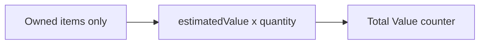
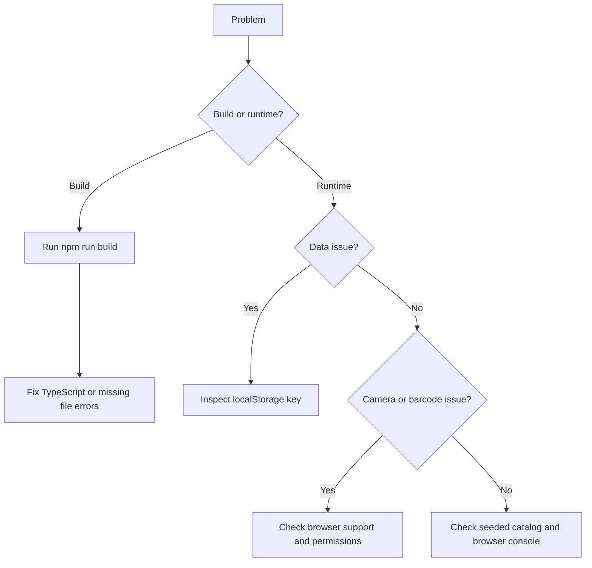

# Troubleshooting

## The App Does Not Start

Run:

```bash
npm install
npm run dev
```

If the dev server port is already used, Vite will usually choose another port and print the URL. Open the URL printed in the terminal.

## Build Fails

Run:

```bash
npm run build
```

Common causes:

- Dependencies were not installed.
- TypeScript errors were introduced.
- A referenced file path was renamed or moved.

After fixing the issue, also run:

```bash
harness validate
```

## My Collection Disappeared

The current app stores data in browser localStorage. Data may disappear if:

- Browser site data was cleared.
- You opened the app in a different browser.
- You used a private browsing session.
- You changed devices.
- The localStorage key was manually deleted.

The storage key is:

```text
brick-ledger.collection.v1
```

## Search Does Not Find a Set

The first version uses a small seeded catalog. If an item is not in `src/domain/catalog.ts`, search will not find it.

Try searching for one of the seeded examples:

- `10305`
- `Tree House`
- `Star Wars`
- `Titanic`
- `sw0001c`
- `cas565`

## Barcode Scanning Does Not Open the Camera

Camera barcode scanning depends on browser and device support.

Check:

- The page is loaded from `localhost` or another secure context.
- The browser has camera permission.
- The device has a camera.
- The browser supports `window.BarcodeDetector`.

If scanning is unsupported, enter the barcode manually in the scanner modal.

## A Barcode Does Not Match Anything

Only barcodes in the seeded catalog resolve to items. Unknown barcodes are copied into the search box so they can be handled manually or after future catalog expansion.

Seeded barcode examples:

| Barcode | Item |
| --- | --- |
| `673419357562` | Lion Knights Castle |
| `673419313957` | Tree House |
| `673419340625` | AT-AT |
| `673419340892` | Titanic |

## Summary Value Looks Wrong

The Value counter includes only collection items, not wishlist items. It multiplies each owned item's estimated value by its quantity.



## Item Edits Are Not Saving

Edits save automatically when app state changes. If edits do not persist after refresh:

- Confirm browser localStorage is enabled.
- Check whether private browsing is blocking persistence.
- Inspect DevTools Application Storage for `brick-ledger.collection.v1`.
- Confirm the stored JSON is an array of valid owned item objects.

Malformed storage entries are ignored by `loadCollection()`.

## Images Do Not Load

Catalog images currently point to external Brickset and BrickLink image URLs. Images may fail if:

- You are offline.
- The image host is unavailable.
- A browser extension blocks the request.
- The external URL changes.

The rest of the app should still work without images.

## Reset Local Data

To reset the collection during development:

1. Open browser DevTools.
2. Go to Application or Storage.
3. Open Local Storage for the current origin.
4. Delete `brick-ledger.collection.v1`.
5. Refresh the app.

## Diagnostic Flow


