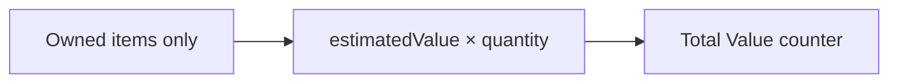
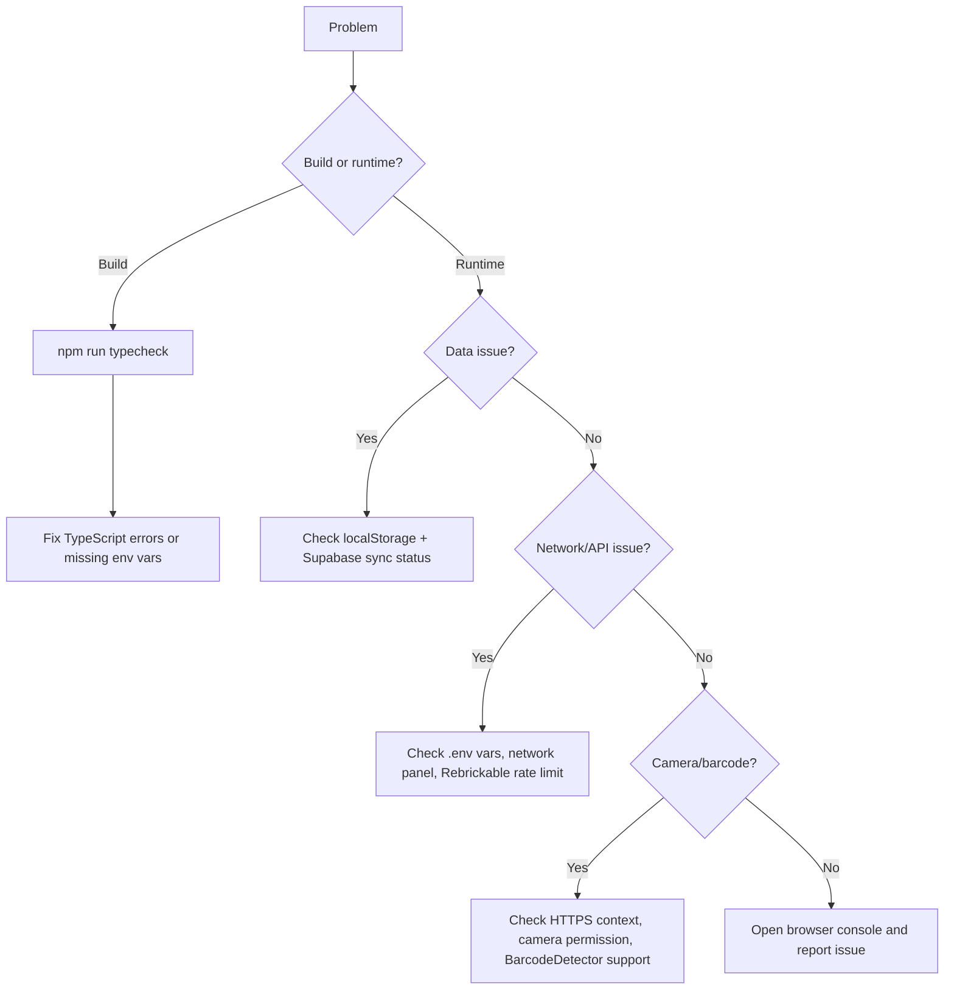

# Troubleshooting

## The App Does Not Start

```bash
npm install
npm run web:dev
```

If the dev server port is already in use, Vite will choose another port and print the URL. Open the URL printed in the terminal.

## Build Fails

```bash
npm run web:build
npm run typecheck
```

Common causes:

- Dependencies not installed — run `npm install` first.
- TypeScript errors introduced — fix and re-run `npm run typecheck`.
- Missing env vars — copy `.env.example` to `.env` and fill in all values.
- A referenced file path was renamed or moved.

## My Collection Disappeared

Collection data is stored in browser localStorage AND synced to Supabase. If local data is gone but cloud sync was working, reload the app — it will pull from Supabase on startup.

If data is missing from both:

- Browser site data was cleared.
- You opened the app in a different browser profile.
- You used a private browsing session (localStorage is not persisted).
- The localStorage key was manually deleted.

The local storage key is:

```text
brick-ledger.collection.v1
```

To inspect it in DevTools: Application → Local Storage → current origin.

## Search Does Not Find a Set

Search chains through three sources:

1. Local seed catalog (instant — ~27k sets)
2. Supabase catalog cache (sub-second)
3. Rebrickable API (live, ~300ms debounce)

If a set cannot be found:

- Verify your `VITE_REBRICKABLE_API_KEY` in `.env` is valid and not rate-limited.
- Check the browser network panel for failed requests to `rebrickable.com`.
- Try the set number directly (e.g. `75192` instead of "Millennium Falcon").
- If Rebrickable is down, the seed catalog is still searched locally.

## Barcode Scanning Does Not Open the Camera

- The page must be loaded from `localhost` or an HTTPS origin.
- The browser must have camera permission for the site.
- The device must have a camera.
- The browser must support `window.BarcodeDetector` (Chrome, Edge; Safari via polyfill).

If scanning is unsupported, click **Enter barcode manually** in the scanner modal.

## A Barcode Does Not Match Anything

The app chains: seed catalog → Supabase cache → Rebrickable live lookup. If Rebrickable returns no result, the barcode is copied into the search box.

Most LEGO EAN-13 barcodes resolve via Rebrickable. If one doesn't:

- Try entering the set number directly instead of scanning.
- The set may be very old or a promotional item not in the Rebrickable database.

## Parts List Does Not Load

Parts are fetched from Rebrickable and cached in Supabase on first view.

If the parts list shows an error or stays blank:

- Verify `VITE_REBRICKABLE_API_KEY` is set and valid.
- Check the network panel for failed requests to `rebrickable.com/api/v3/lego/sets/{setNum}/parts/`.
- The Rebrickable free tier has a rate limit — wait 60 seconds and try again.
- Parts for very old or promotional sets may not be in the Rebrickable database.

## Building Instructions Not Found

Instructions are fetched by a Supabase Edge Function that scrapes LEGO's instructions page.

If "No instruction files found" appears:

- The Edge Function requires the `LEGO_INSTRUCTIONS_BASE_URL` environment variable to be set in Supabase.
- Very old sets may not have digital instructions on LEGO.com.
- Click the **LEGO.com ↗** link to browse instructions manually.

## Cloud Sync Is Failing

The Sync indicator turns red when sync fails. Click **Retry** to force a sync attempt.

Check:

- `VITE_SUPABASE_URL` and `VITE_SUPABASE_PUBLISHABLE_KEY` are set correctly in `.env`.
- Your Supabase project is online and the `user_collection` table exists (run pending migrations if needed).
- You are authenticated — the app uses Supabase Auth; unauthenticated sessions cannot sync.

## Summary Value Looks Wrong

The Value counter covers only **collection items** (not wishlist). It sums `estimatedValue × quantity` for every owned item.



Estimated values are static catalog data — they do not update with live market prices.

## Item Edits Are Not Saving

Edits write to localStorage immediately. If edits do not survive a page refresh:

- Confirm localStorage is enabled (not blocked by a browser extension or policy).
- Check private browsing — localStorage is cleared when the session ends.
- Inspect DevTools: Application → Local Storage → `brick-ledger.collection.v1`.
- Confirm the stored value is valid JSON (an array of item objects).

Malformed entries are silently dropped by the validator on load.

## Images Do Not Load

Images point to Rebrickable's CDN. They may fail if:

- You are offline.
- The Rebrickable CDN is unavailable.
- A browser extension blocks external image requests.

The rest of the app continues to function without images.

## Reset Local Data

1. Open browser DevTools.
2. Go to Application → Local Storage.
3. Delete `brick-ledger.collection.v1` and `brick-ledger.sync-queue.v1`.
4. Refresh the app.

Cloud data is unaffected — on reload the app pulls from Supabase.

## Diagnostic Flow


