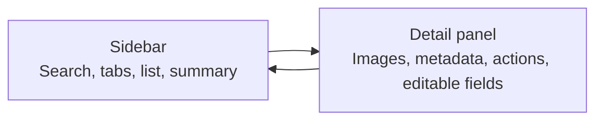
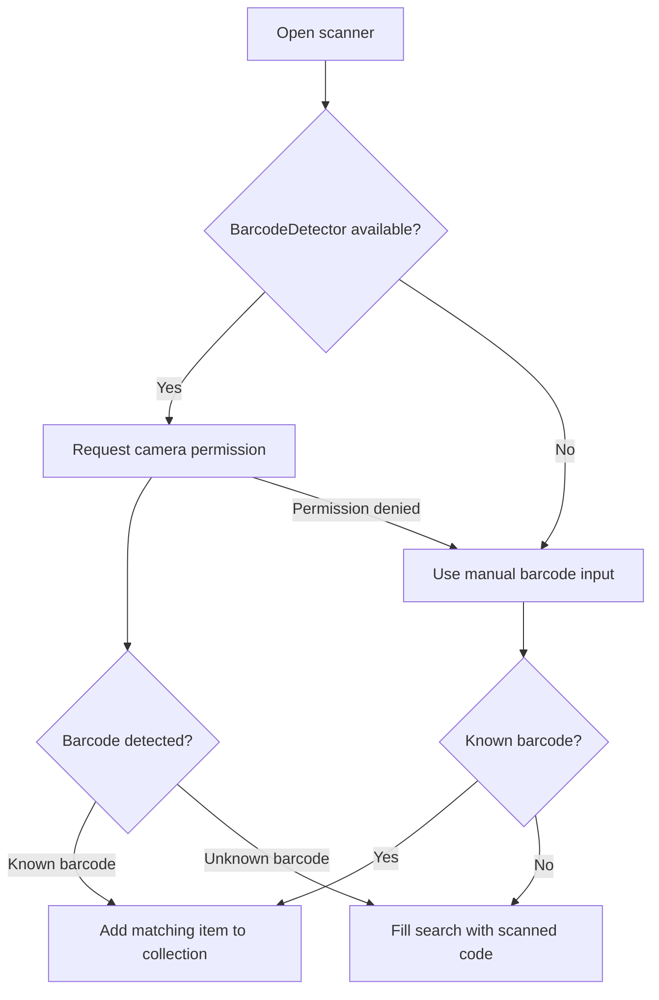
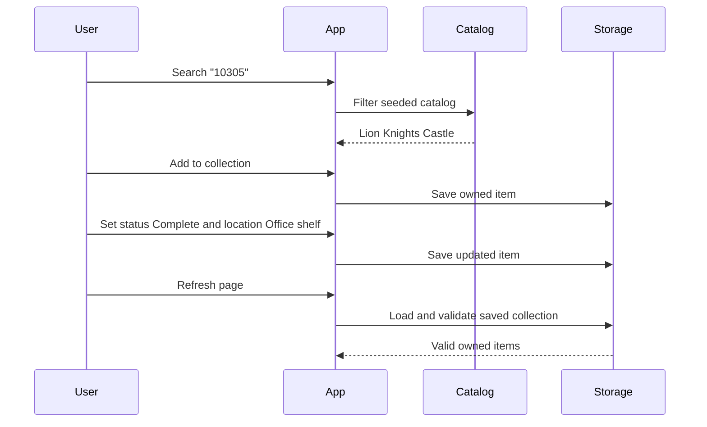

# User Guide

Brick Ledger tracks LEGO sets and minifigs across a collection and wishlist. The current app is web-first and stores records locally in your browser.

## Main Screen

The app has two main areas:

- Sidebar: summary counters, search, barcode scanner, tabs, and item list.
- Detail panel: selected set or minifig details, add actions, and editable collection fields.

## Search

Use the search box to find seeded catalog items by:

- Set number, such as `10305`
- Minifig number, such as `sw0001c`
- Theme, such as `Icons`, `Castle`, or `Star Wars`
- Keyword in the item name
- Type, such as `set` or `minifig`
- Seeded barcode value

Search runs against the local seeded catalog in `src/domain/catalog.ts`.

## Add an Item

From the Catalog tab:

1. Search or browse the catalog.
2. Select an item to inspect its details.
3. Click **Add to collection** to track ownership.
4. Click **Add to wishlist** to save it for later.

You can also use the plus button in a catalog row to add directly to the collection.

## Collection and Wishlist

Use the tabs to switch views:

- Catalog: searchable seeded catalog entries.
- Collection: items you own.
- Wishlist: items you want.

When an owned or wishlist item is selected, the detail panel shows editable tracking fields.

## Detail Fields

| Field | Purpose |
| --- | --- |
| List | Moves the item between Collection and Wishlist. |
| Set quality when bought | Records condition at acquisition time. |
| Building status | Tracks whether the build is not started, in progress, or complete. |
| Display location | Records where the item is displayed or stored. |
| Quantity | Counts duplicates and affects total estimated owned value. |
| Box saved | Tracks whether the original box was kept. |
| Missing parts | Stores missing part IDs, colors, or descriptive notes. |
| Notes | Stores any other ownership notes. |

Changes save automatically to localStorage.

## Summary Counters

| Counter | Meaning |
| --- | --- |
| Owned | Number of items in the Collection list. |
| Wishlist | Number of items in the Wishlist list. |
| Value | Sum of estimated value for owned items multiplied by quantity. |
| Built | Number of items marked Complete. |

## Barcode Scanning

Open the scanner with the barcode icon beside the search box.

Seeded barcode examples:

| Barcode | Catalog Item |
| --- | --- |
| `673419357562` | Lion Knights Castle |
| `673419313957` | Tree House |
| `673419340625` | AT-AT |
| `673419340892` | Titanic |

## Remove an Item

1. Open Collection or Wishlist.
2. Select the item.
3. Click **Remove from lists** in the detail form.

The item remains available in the Catalog tab because removal only deletes the local owned/wishlist record.

## Example Workflow

## Privacy and Data Ownership

The current version stores data only in your browser. It does not upload collection data to a server.

Clearing browser site data, switching browsers, or using a different device means the app will not see the previous local collection.
